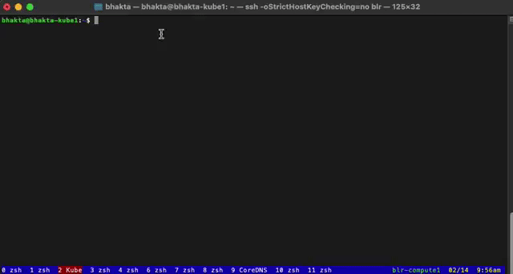

# kube-alias
Short-hand commands for some of the day-to-day kubernetes CLI. The goal is to minimize the number of characters to type and work across namespaces. The utility is easy to extend to other commands.




# Install/setup

1. Make sure kube-alias.py is executable (if not already): chmod +x kube-cmd.py
2. Optionally set up an alias: alias k='/path/to/kube-cmd.py'


# Usage example

1. Describe a POD

instead of

```
kubectl describe pod nodelocaldns-tdvpn -n kube-system
```

Use:
```
k des pod nodelocaldns-td
```


2. Providing minimal number of characters for a match.

If your input causes a conflict, the tool will spit out an error and ask you to pick a more specific match substring.

e.g.

```
bhakta@bhakta-kube1:~$ k d p nodelocaldns
'd' matches multiple possible options
    describe
    delete
Please provide more specific input

bhakta@bhakta-kube1:~$ k des p nodelocaldns
'p' matches multiple possible options
    pod
    pv
    pvc
Please provide more specific input

bhakta@bhakta-kube1:~$ k des pod nodelocaldns
command 'kubectl get pods -A | egrep "nodelocaldns"' has multiple matches:
    nodelocaldns-tdvpn -n kube-system
    nodelocaldns-xmqlf -n kube-system
    nodelocaldns-z6dsj -n kube-system
kubectl describe pod needs 1 match. Provide more specific substring input

bhakta@bhakta-kube1:~$ k des pod nodelocaldns-td
kubectl describe pod nodelocaldns-tdvpn -n kube-system

Executing : kubectl describe pod nodelocaldns-tdvpn -n kube-system
------------------------------------------------------------------
<snip>
```

3. Get into a pod


Instead of:

```
kubectl exec -it pg-postgresql-0 -n lilac-sql -- bash
```

use:

```
bhakta@bhakta-kube1:~$ k ex sql
command 'kubectl get pods -A | egrep "sql"' has multiple matches:
    -it pg-pgpool-857694cff-qs44s -n lilac-sql
    -it pg-pgpool-857694cff-qvqhz -n lilac-sql
    -it pg-postgresql-0 -n lilac-sql
    -it pg-postgresql-1 -n lilac-sql
kubectl exec needs 1 match. Provide more specific substring input


bhakta@bhakta-kube1:~$ k ex ql-0
kubectl exec -it pg-postgresql-0 -n lilac-sql -- bash

Executing : kubectl exec -it pg-postgresql-0 -n lilac-sql -- bash
-----------------------------------------------------------------

Defaulting container name to postgresql.
Use 'kubectl describe pod/pg-postgresql-0 -n lilac-sql' to see all of the containers in this pod.
I have no name!@pg-postgresql-0:/$
I have no name!@pg-postgresql-0:/$ psql -U postgres
Password for user postgres:
psql (11.13)
Type "help" for help.

postgres=#

```

4. Tail log of a pod

Instead of:

```
kubectl logs lilac-api-d689b97b4-tpq5v -n lilac-mgmt
```

Use:

```
bhakta@bhakta-kube1:~$ k l api-d
kubectl logs lilac-api-d689b97b4-tpq5v -n lilac-mgmt

Executing : kubectl logs lilac-api-d689b97b4-tpq5v -n lilac-mgmt
----------------------------------------------------------------
<snip>
```

4. Tail logs (for a container within a pod)


Instead of:

```
kubectl logs pg-postgresql-0 -n lilac-sql -c metrics
```

use:

```
bhakta@bhakta-kube1:~$ k l sql-0 -c metrics
['pg-postgresql-0 -n lilac-sql -c metrics']
kubectl logs pg-postgresql-0 -n lilac-sql -c metrics

Executing : kubectl logs pg-postgresql-0 -n lilac-sql -c metrics
----------------------------------------------------------------

time="2022-01-31T12:24:56Z" level=info msg="Established new database connection to \"127.0.0.1:5432\"." source="postgres_exporter.go:878"
time="2022-01-31T12:24:57Z" level=info msg="Established new database connection to \"127.0.0.1:5432\"." source="postgres_exporter.go:878"
time="2022-01-31T12:24:59Z" level=info msg="Established new database connection to \"127.0.0.1:5432\"." source="postgres_exporter.go:878"
time="2022-01-31T12:24:59Z" level=info msg="Semantic Version Changed on \"127.0.0.1:5432\": 0.0.0 -> 11.13.0" source="postgres_exporter.go:1405"
time="2022-01-31T12:24:59Z" level=info msg="Starting Server: :9187" source="postgres_exporter.go:1672"
bhakta@bhakta-kube1:~$
```

# Adding more commands

Add into _CMD_MAP in kube-alias.py


# TODO:
